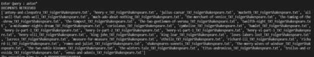

**Boolean Retrieval System**

Our retrieval system returns the names of documents from the given dataset that satisfy the boolean query entered. The boolean queries supported are AND, OR, and NOT and their different combinations. The system is also capable of handling different wildcard queries.

Our code performs 4 different operations:

- Preprocessing (Stopword removal and Stemming)
- Index Building (Inverted Index and Permuterm)
- Query Handling
- Spelling Correction (Edit Distance Method)

For preprocessing, we run through the dataset to tokenize all the documents. This is followed by removing all the stopwords.

In this example, our code removes words like ‘on’, ‘not’, ‘a’, ‘of’, ’them’, ‘other’, ‘they’, ‘have’, ‘of’, and ‘me’.

The remaining tokens are then stemmed using Porter Stemmer to give the final set of tokens.

In this example, the words ‘laughing’, ‘laugh’, ‘laughed’, and ‘laughs’ are all stemmed to ‘laugh’.

We then create an inverted index for each stemmed word. This gives us a list of all document names in which each word is present.

The structure of our inverted index dictionary is:

‘antonio’ -> [list of documents which contain word ‘antonio’]

‘brutus’ -> [list of documents which contain word ‘brutus’]

And so on.

For creating a permuterm index, we append a ‘$’ sign to each word and generate different permutations for it.

The structure of our permuterm index dictionary is:

‘bat$’ -> [bat]

‘$bat’ -> [bat]

‘t$ba’ -> [bat]

‘at$b’ -> [bat]

And so on for other words.

When the code is run, the user enters a query which is either a boolean query or a wildcard query.

If it is a boolean query, we call the function bool\_query which returns the retrieved documents.

If it is a wildcard query, we first process it and then call the processQuery function which prints the retrieved document list.

For boolean queries, in case of spelling errors, we also check for edit distance to get the closest possible words.

